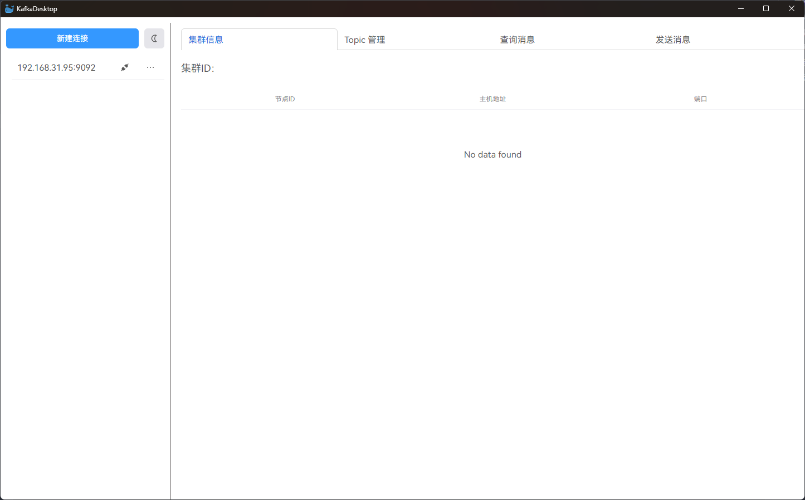
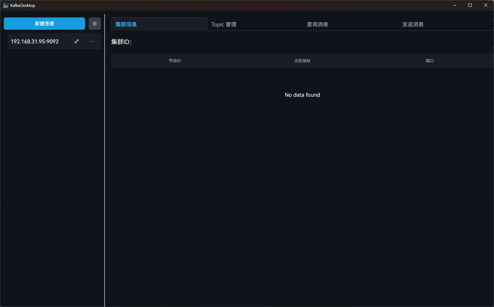
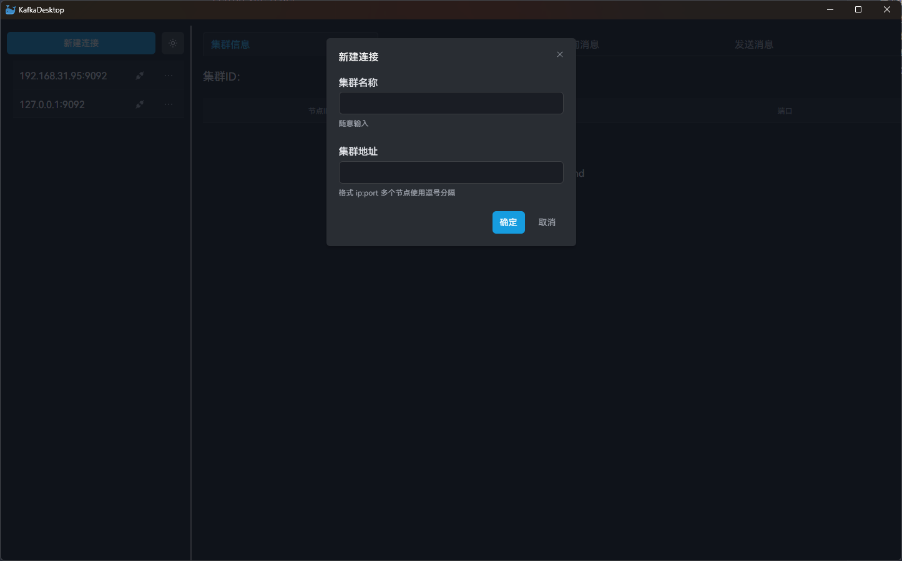
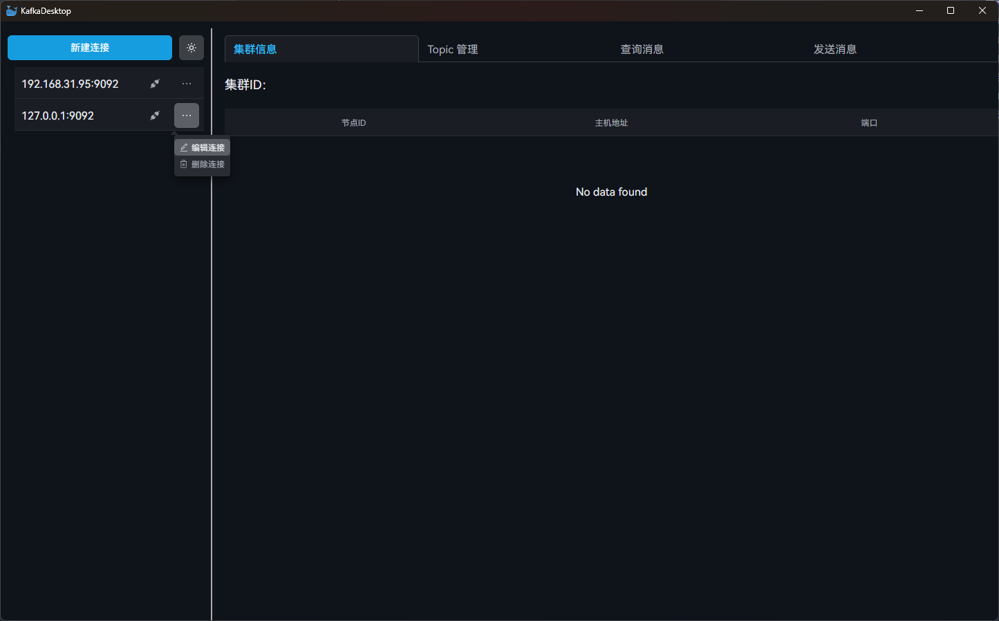
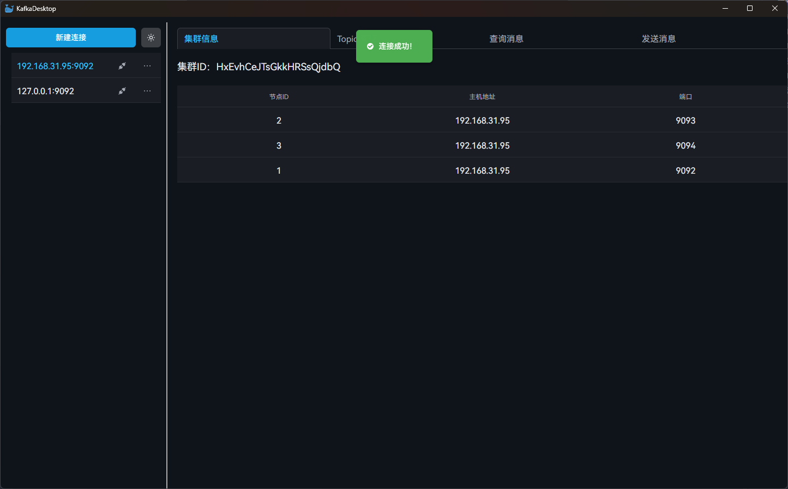
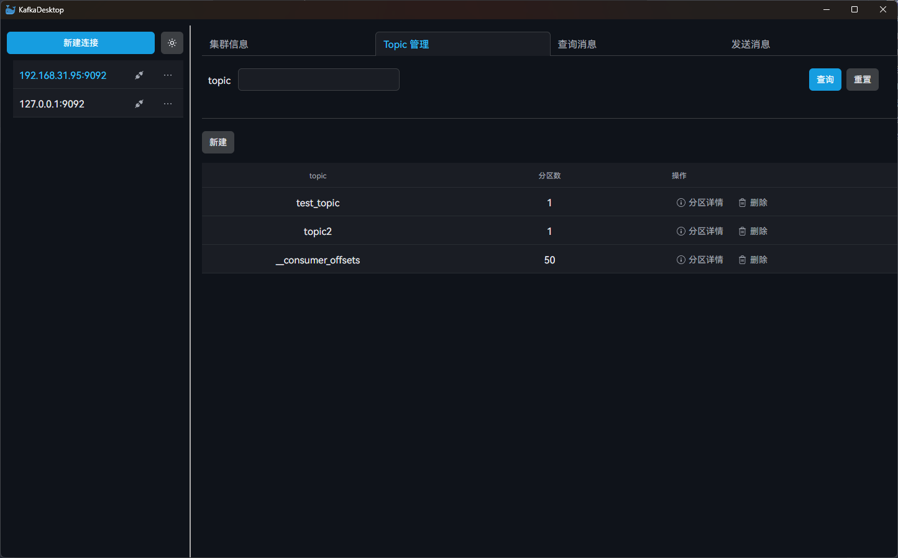
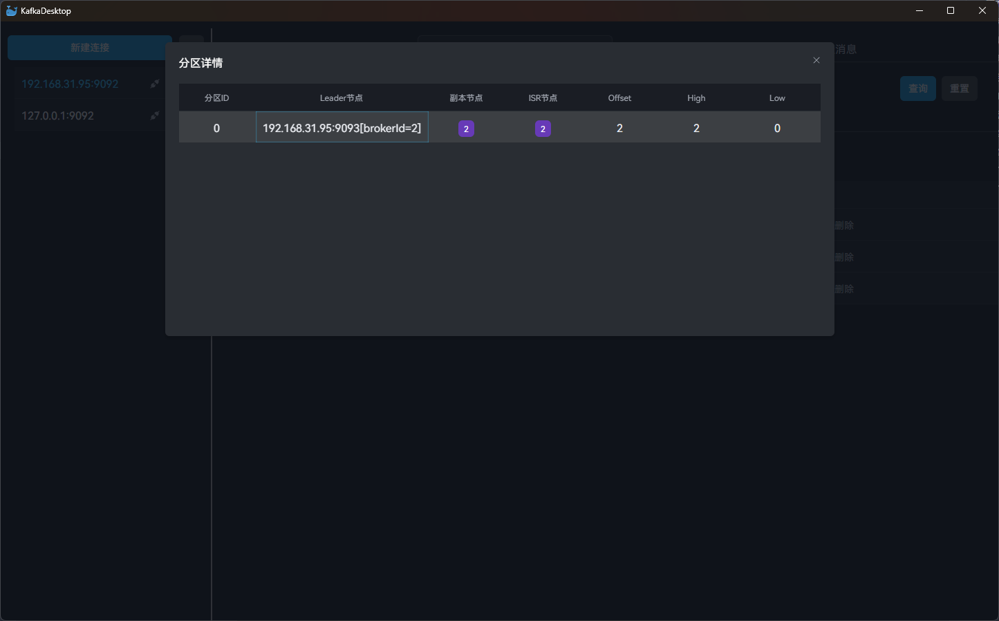
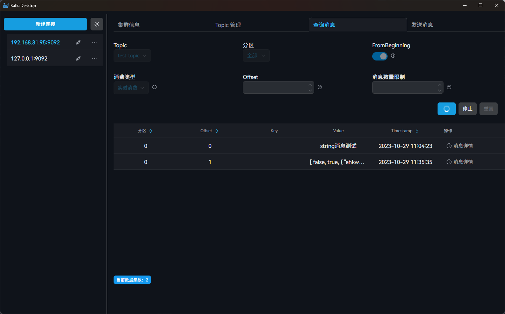
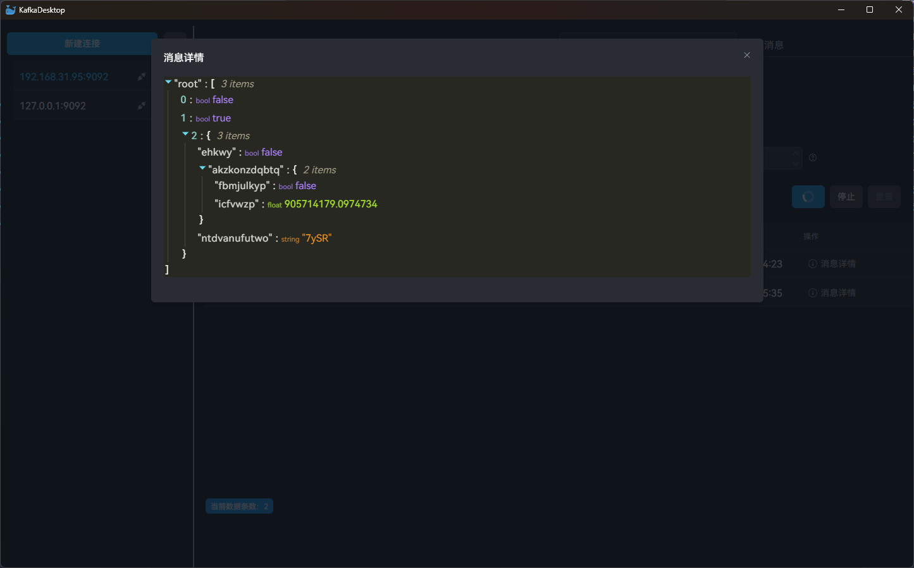
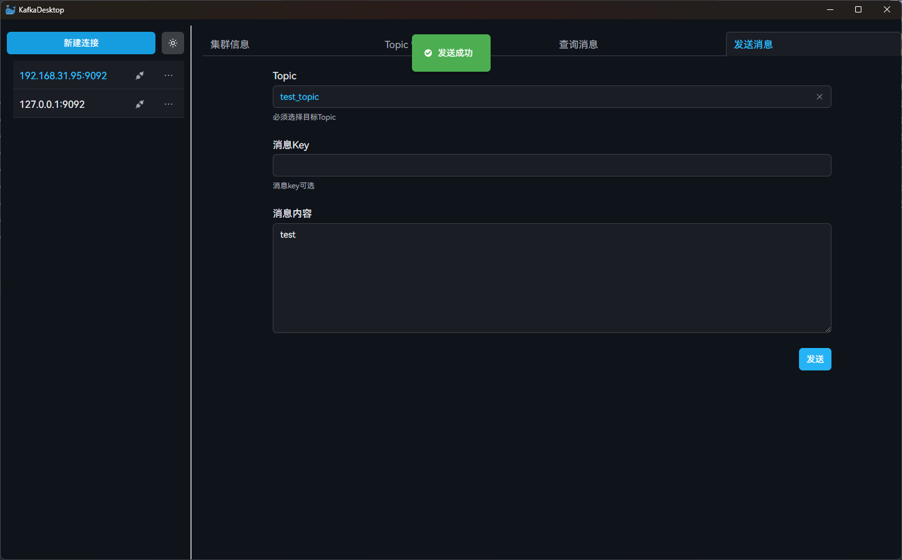

# KafkaDesktop

> 一款轻量级 kafka 桌面端管理工具

## 技术栈
- 项目脚手架 Electron + Vite + React + TypeScript： https://github.com/electron-vite/electron-vite-react
- 组件库 React Suite： https://github.com/rsuite/rsuite/tree/main
- Kafka 客户端库 KafkaJs： https://github.com/tulios/kafkajs
- 配置文件存储 electron-store： https://github.com/sindresorhus/electron-store
- 跨组件通信 PubSubJS： https://github.com/mroderick/PubSubJS

## 支持功能
- 支持 Kafka 集群多连接管理
- 集群节点信息查看
- Topic 管理：新增、删除、模糊查询和 topic 分区信息查看
- 查询消息：从头消费、实时消费、单次拉取消费、指定 offset 消费、指定分区消费
- 消费到消息支持 json 消息自动格式化查看
- 消息发送：支持指定消息 key
- 主题切换：亮色 / 暗色主题切换
- 全局字体使用：[HarmonyOS Sans 字体](https://developer.harmonyos.com/cn/design/resource)

## 下载体验
进入 release 页面，下载最新版本的安装包即可： https://github.com/hczs/kafka-desktop/releases

## 工具截图
### 亮色主题

### 暗色主题

### 添加连接

### 集群连接管理

### 集群信息查看

### Topic 管理

### Topic 分区信息查看

### 消息拉取

### 消息查看

### 消息发送


## 开发步骤
项目开发环境 node 版本：v18.12.1
```bash
# 克隆项目
git clone https://github.com/hczs/kafka-desktop

# 进入项目文件夹
cd kafka-desktop

# 安装依赖
npm install

# 运行项目
npm run dev
```